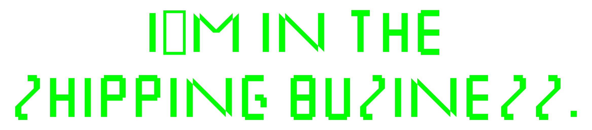

  

 

  

 

<pre><code>$ ls --shipped
<a href="https://github.com/JordanNewell/curtis-ai-chat">curtis-ai-chat/</a>         polyglot AI chat for obsidian, MIT
<a href="https://github.com/JordanNewell/curtis-compliance">curtis-compliance/</a>      fintech compliance, npm
<a href="https://github.com/JordanNewell/harbormasterd">harbormasterd/</a>          multi-vm orchestration, pypi
<a href="https://github.com/JordanNewell/temporal-git">temporal-git/</a>           time-travel for git
<a href="https://github.com/JordanNewell/crypto-key-classifier">crypto-key-classifier/</a>  key attribution

$ fleet
15 openclaw agents · 10 hosts · matrix-e2ee'd

$ contact
<a href="https://jordannewell.com">site</a> · <a href="https://jordannewell.com/posts/">blog</a> · <a href="https://jordannewell.com/today/">today</a> · <a href="https://status.jordannewell.com">status</a> · <a href="https://github.com/sponsors/JordanNewell">sponsors</a></code></pre>

 

  

 

<em>if you made it this far, i appreciate it.</em>

  

