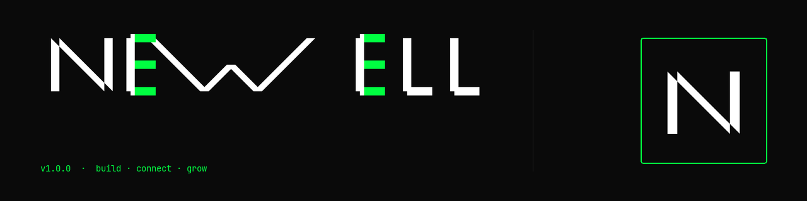

  

 

<table width="100%" cellpadding="0" cellspacing="0" border="0">
  <tr>
    <td width="58%" valign="top">
      <b>SHIPPED</b>
      <table cellpadding="4" cellspacing="0" border="0" width="100%">
        <tr>
          <td><code><a href="https://github.com/JordanNewell/curtis-ai-chat">curtis-ai-chat</a></code></td>
          <td align="right">polyglot AI chat</td>
        </tr>
        <tr>
          <td><code><a href="https://github.com/JordanNewell/curtis-compliance">curtis-compliance</a></code></td>
          <td align="right">fintech compliance</td>
        </tr>
        <tr>
          <td><code><a href="https://github.com/JordanNewell/harbormasterd">harbormasterd</a></code></td>
          <td align="right">multi-vm orchestration</td>
        </tr>
        <tr>
          <td><code><a href="https://github.com/JordanNewell/temporal-git">temporal-git</a></code></td>
          <td align="right">time-travel for git</td>
        </tr>
        <tr>
          <td><code><a href="https://github.com/JordanNewell/crypto-key-classifier">crypto-key-classifier</a></code></td>
          <td align="right">key attribution</td>
        </tr>
        <tr>
          <td><code><a href="https://github.com/JordanNewell/newell-typeface">newell-typeface</a></code></td>
          <td align="right">geometric typeface</td>
        </tr>
        <tr>
          <td><code><a href="https://github.com/JordanNewell/pat-scanner">pat-scanner</a></code></td>
          <td align="right">PAT class scanner</td>
        </tr>
        <tr>
          <td><code><a href="https://github.com/JordanNewell/token-hunt">token-hunt</a></code></td>
          <td align="right">OSS secret scanner</td>
        </tr>
      </table>
    </td>
    <td width="42%" valign="top" style="padding-left:32px">
      <b>OPERATIONS</b>
      <table cellpadding="4" cellspacing="0" border="0" width="100%">
        <tr><td><code>fleet</code></td><td align="right">17 agents · 10 hosts</td></tr>
        <tr><td><code>matrix</code></td><td align="right">snikket · e2ee'd</td></tr>
        <tr><td><code>locale</code></td><td align="right">nz · gmt+12</td></tr>
      </table>
       
      <b>CONTACT</b>
      <table cellpadding="4" cellspacing="0" border="0" width="100%">
        <tr><td><code><a href="https://jordannewell.com">site</a></code></td><td align="right"><a href="https://jordannewell.com/posts/">blog</a></td></tr>
        <tr><td><code><a href="https://jordannewell.com/today/">today</a></code></td><td align="right"><a href="https://status.jordannewell.com">status</a></td></tr>
        <tr><td><code><a href="https://github.com/sponsors/JordanNewell">sponsors</a></code></td><td align="right">★</td></tr>
      </table>
    </td>
  </tr>
</table>

 

  

